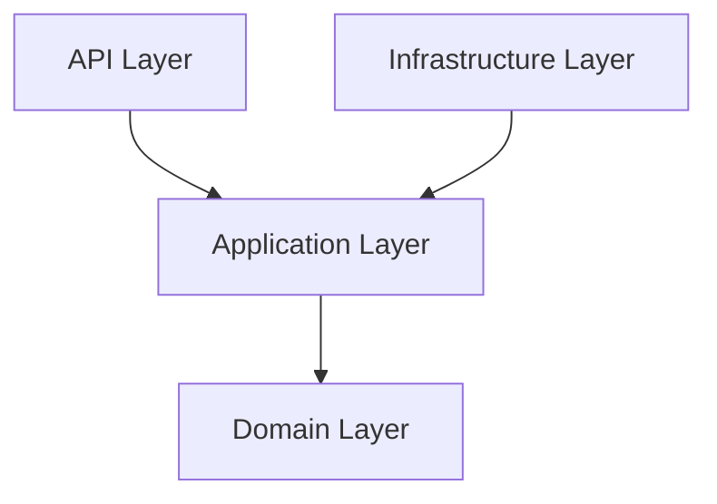
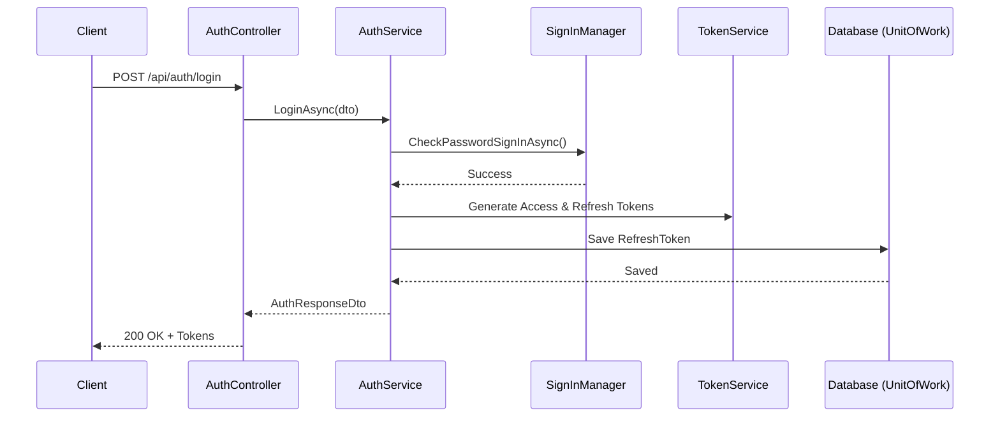
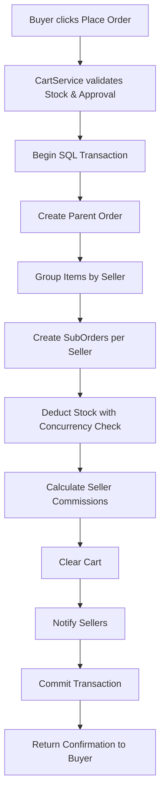
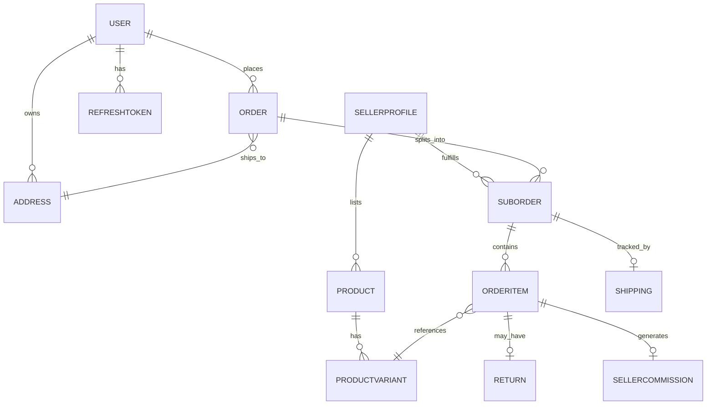

# MenaCart Backend Official Documentation

This document serves as the official, comprehensive technical guide for the MenaCart Backend. It is designed to be the single source of truth for new developers, technical reviewers, and future AI assistants. 

---

## 1. Project Overview

**What is MenaCart?**
MenaCart is a multi-vendor e-commerce platform, similar to Amazon or Etsy. It allows independent sellers to list their products, and buyers to purchase items from multiple sellers in a single checkout experience. 

**What problems does it solve?**
Traditional e-commerce platforms often assume a single seller fulfilling an entire order. MenaCart solves the complex logistical and financial problem of **order splitting**. When a buyer purchases from three different sellers, the system automatically splits the order, routes fulfillment to the respective sellers, and accurately calculates the platform's commission for each item.

**Who are the users?**
1. **Buyers**: Browse products, manage carts, checkout, and request returns.
2. **Sellers**: Onboard, list products, fulfill orders, process returns, and request payouts.
3. **Admins**: Approve seller accounts, approve product listings, manage platform coupons, and process seller payouts.

**Main Business Goals:**
- Provide a seamless multi-vendor shopping experience.
- Ensure strict financial accuracy for seller payouts and platform commissions.
- Maintain high security for user data and authentication.

---

## 2. High-Level Architecture

MenaCart uses **Clean Architecture** to enforce separation of concerns, making the system highly testable, maintainable, and decoupled from specific frameworks (like Entity Framework or ASP.NET).

### Why Clean Architecture?
It ensures that the core business rules (Domain) are isolated from UI (API) and data access (Infrastructure). If the database changes from SQL Server to PostgreSQL, the Domain and Application layers remain completely untouched.

### Layer Responsibilities & Dependency Direction

**Dependency Rule**: Outer layers depend on inner layers. Inner layers know nothing about outer layers.



1. **Domain Layer**: The core. Contains Entities (`Order`, `Product`), Enums, and core business rules. Depends on NOTHING.
2. **Application Layer**: Contains Business Logic (`OrderService`, `AuthService`), Interfaces (`IUnitOfWork`, `IOrderRepository`), and DTOs. Depends ONLY on Domain.
3. **Infrastructure Layer**: Implements the Application interfaces. Contains `AppDbContext`, EF Core Migrations, and Repositories. Depends on Application and Domain.
4. **API Layer**: The entry point. Contains Controllers, Dependency Injection wiring, and Program.cs. Depends on Application and Infrastructure.

---

## 3. Project Structure

```text
MenaCart/
├── API/                 # Presentation layer
│   ├── Controllers/     # HTTP endpoints (e.g., OrdersController)
│   ├── Extensions/      # DI wiring and Swagger setup
│   └── Program.cs       # App entry point
├── Application/         # Business logic layer
│   ├── DTOs/            # Data Transfer Objects (input/output shapes)
│   ├── Interfaces/      # Contracts for Services and Repositories
│   └── Services/        # Concrete business logic (e.g., CartService)
├── Domain/              # Core business models
│   ├── Enums/           # Status enums (e.g., OrderStatus)
│   ├── Models/          # EF Core Entities (e.g., Product, SubOrder)
│   └── Security/        # Security models (e.g., RefreshToken)
└── Infrastructure/      # Data access layer
    ├── Database/        # AppDbContext and EF Configurations
    ├── Migrations/      # EF Core database migrations
    └── Repositories/    # Concrete data access implementations
```

---

## 4. Business Modules

### Authentication
- **Purpose**: Manage user identity, login, and secure sessions.
- **Classes**: `AuthService`, `RefreshToken`, `AuthController`.
- **Flow**: Issues JWTs for short-term access and rotating Refresh Tokens for long-term sessions.

### Products & Categories
- **Purpose**: Manage the catalog. Sellers create products; admins approve them.
- **Classes**: `ProductService`, `CategoryService`, `ProductsController`.
- **Database**: `Products`, `ProductVariants`, `Categories`.

### Shopping Cart
- **Purpose**: Temporary storage for buyer intentions.
- **Classes**: `CartService`, `CartController`.
- **Rules**: Validates stock and product approval status before allowing checkout.

### Orders (The Core Module)
- **Purpose**: Convert a cart into financial and fulfillment records.
- **Classes**: `OrderService`, `OrdersController`.
- **Rules**: Splits a single `Order` into multiple `SubOrder`s per seller. Calculates `SellerCommission`. Uses `RowVersion` for concurrency-safe stock deduction.

### Returns & Exchanges
- **Purpose**: Manage post-delivery customer satisfaction.
- **Classes**: `ReturnService`, `ReturnsController`.
- **Rules**: Must be within 14 days of `DeliveredAt`. Exchanges reserve stock immediately upon approval.

### Payouts & Commissions
- **Purpose**: Pay sellers their earnings minus platform fees.
- **Classes**: `PayoutService`, `PayoutsController`.
- **Rules**: Admins review and mark payouts as Paid. Uses concurrency tokens to prevent double-paying.

---

## 5. Request Lifecycle (Example: Login)

Every request follows a strict path from the client to the database and back.



---

## 6. Backend Logical Flow (Order Placement)



---

## 7. Database Design

### Key Entities:
1. **Order**: The parent record. Represents the buyer's single transaction and total payment.
2. **SubOrder**: The seller's fulfillment record. Linked to an `Order` and a `SellerId`. Unique constraint on `(OrderId, SellerId)`.
3. **OrderItem**: The actual product variant purchased, linked to a `SubOrder`. Locks in the `PriceAtPurchase`.
4. **ProductVariant**: Holds `StockQuantity` and `RowVersion` (Timestamp) to prevent overselling.
5. **SellerCommission**: Tracks platform fees per `OrderItem`.
6. **RefreshToken**: Tracks active and revoked sessions for security.

### Business Rules via Schema:
- **Soft Delete**: `Product` and `Address` use `IsActive` flags. Hard deletes are forbidden to protect historical order records.
- **Cascade Restrict**: `Order -> Address` is restricted. You cannot delete an address that an order relies on.
- **Enum Strings**: All statuses (`OrderStatus`, `PaymentStatus`) are stored as readable `NVARCHAR` strings, not integers.

---

## 8. Entity Relationships



---

## 9. Authentication Flow

MenaCart uses **Stateless JWTs** combined with **Stateful Refresh Tokens**.

- **Login**: Generates a 15-minute Access Token (JWT) and a 7-day Refresh Token.
- **Access Token**: Sent in the `Authorization: Bearer` header. Verified statelessly by the API.
- **Refresh Token**: Stored in the DB. When the JWT expires, the client sends the Refresh Token to get a new pair.
- **Token Rotation**: Every time a refresh token is used, it is marked as `Revoked` and a new one is issued.
- **Reuse Detection**: If a client attempts to use an already `Revoked` refresh token, the system assumes a replay attack (stolen token) and immediately revokes ALL active tokens for that user, forcing a re-login.

---

## 10. Order Workflow

1. **Cart**: Buyer adds items. Stock is loosely checked.
2. **Checkout**: Buyer submits order.
3. **Transaction**: A database transaction begins.
4. **Validation**: Stock is strictly checked using `RowVersion`. If a race condition occurs, EF Core throws a `DbUpdateConcurrencyException`, the transaction rolls back, and the user is prompted to try again.
5. **Splitting**: Items are grouped by Seller. `SubOrder`s are created.
6. **Fulfillment**: Sellers update their `SubOrder` to `Shipped` and provide tracking.
7. **Delivery**: Order is marked `Delivered`, `Shipping.DeliveredAt` is stamped (starting the Return Window).

---

## 11. Returns & Exchanges Workflow

1. **Request**: Buyer requests a return within 14 days of `DeliveredAt`.
2. **Validation**: System ensures item is delivered and no duplicate active return exists.
3. **Review**: Seller or Admin approves/rejects.
4. **Exchange**: If exchange, target variant stock is immediately decremented/reserved upon approval.
5. **Return**: If return, original stock is incremented upon completion, and payment status updates to `Refunded`.

---

## 12. Error Handling Strategy

- **Validation**: Handled via Data Annotations on DTOs (400 Bad Request).
- **Business Rule Violations**: Handled by throwing specific exceptions (`KeyNotFoundException` for 404, `UnauthorizedAccessException` for 403, `InvalidOperationException` for 400/409 conflicts).
- *(Future)*: A global middleware should catch these and format standard RFC 7807 Problem Details. Currently, controllers use `try/catch` blocks.

---

## 13. Security

- **Authorization**: Role-based (`[Authorize(Roles="Seller")]`).
- **Ownership Checks**: Controllers often pass `User.GetUserId()` to the Service. The Service queries the DB ensuring the requested resource belongs to that User/Seller. **Never trust a client-provided UserId.**
- **Concurrency**: EF Core `[Timestamp]` / `RowVersion` prevents malicious or accidental race conditions on financial and inventory records.

---

## 14. Design Decisions (Architecture Decision Records)

### Why Clean Architecture?
To decouple business logic from the ASP.NET framework. Ensures high testability.

### Why Unit of Work?
When placing an order, we touch Orders, SubOrders, Items, Commissions, and Stock. If any step fails, we must roll back everything. `UnitOfWork` wraps all repositories in a single `SaveAsync()` transaction.

### Why Token Rotation & Reuse Detection?
If a refresh token is stolen, the attacker could theoretically stay logged in forever. Rotation limits the window. Reuse detection actively kills the attacker's session if the legitimate user and attacker both try to refresh.

### Why Enum String Conversion?
Storing `1` or `2` in the database for `OrderStatus` makes manual database querying impossible to read. Converting Enums to Strings at the EF Core level means the DB stores `'Placed'` or `'Shipped'`, maintaining sanity for DBAs.

### Why DeliveredAt?
You cannot calculate a 14-day return window from an integer status flag. A concrete timestamp of delivery is required for legal/business enforcement.

---

## 15. API Documentation (High Level)

*Swagger UI is available at `/swagger` when running in Development mode.*

**Key Endpoints:**
- `POST /api/auth/login`: Authenticate.
- `GET /api/products`: Browse catalog (Anonymous).
- `POST /api/orders`: Place an order (Buyer).
- `GET /api/seller/suborders`: View seller's orders (Seller).
- `PATCH /api/seller/suborders/{id}/status`: Fulfill order (Seller).
- `POST /api/payouts/request`: Request commission payout (Seller).

---

## 16. Complete Business Flow (The Story)

**Registration to Refund:**
Alice registers as a Buyer. Bob registers, applies via `/api/seller/apply`, uploads KYC docs, and an Admin approves him (assigning the `Seller` role). Bob creates a Product (Shirt). Admin approves the Shirt.
Alice browses, adds the Shirt to her Cart. Alice checks out. The system creates an `Order`, splits it into a `SubOrder` for Bob, deducts the Shirt's stock (safely), and logs a pending `SellerCommission` for the platform.
Bob sees the order, ships it, and marks it `Delivered`.
Alice receives it, but it's too small. She requests an Exchange within 14 days. Bob approves the exchange. The system reserves stock for the new size. Bob ships the new size, receives the old size, and the transaction is Complete.

---

## 17. Developer Guide

**How to add a new Entity:**
1. Create the class in `Domain/Models`.
2. Add a `DbSet` to `Infrastructure/Database/AppDbContext.cs`.
3. Add configuration to `AppDbContext.OnModelCreating` (e.g., Enum conversions, cascade deletes).
4. Run `dotnet ef migrations add NameOfMigration`.
5. Run `dotnet ef database update`.

**How to add a Service:**
1. Create `IFeatureService` in `Application/Interfaces`.
2. Create `FeatureService` in `Application/Services`.
3. Register it in `API/Extensions/DbExtensions.cs` (e.g., `services.AddScoped<IFeatureService, FeatureService>()`).
4. Create `FeatureController` in `API/Controllers` and inject the interface.

**Coding Standards:**
- Controllers MUST NOT contain business logic. They only map HTTP to DTOs.
- Services MUST handle ownership checks (e.g., verify the user owns the cart).
- Repositories MUST return `IQueryable` for complex filters, or concrete lists for simple queries.

---

## 18. Future Improvements

**Recommended:**
1. **Global Exception Handling Middleware**: Replace `try/catch` in controllers with a global interceptor.
2. **Real Payment Gateway Integration**: Replace `MockPaymentGatewayService` with Stripe SDK.
3. **Pagination Wrapper**: Wrap `IEnumerable<T>` in a `PagedResult<T>` containing `TotalPages`, `CurrentPage` metadata.

**Optional:**
1. **Wishlist Implementation**: The entity exists, but the CRUD service/controller is skipped.
2. **Notifications Read Status**: Build a `GET /api/notifications` endpoint to consume the alerts currently being generated by the system.

---

## 19. AI Knowledge Base

*Instructions for future AI Assistants interacting with this codebase:*

- **Project Conventions**: Clean Architecture. Do NOT inject `AppDbContext` directly into Controllers. Always route through Services and `IUnitOfWork`.
- **Dependency Injection**: Registered in `API/Extensions/DbExtensions.cs`. 
- **DTO Strategy**: Input DTOs are named `CreateXRequestDto` or `UpdateXRequestDto`. Output DTOs are named `XResponseDto`.
- **Validation**: Use Data Annotations on DTOs. 
- **Error Handling**: Throw `UnauthorizedAccessException` for 403, `KeyNotFoundException` for 404. 
- **Transactions**: If modifying multiple aggregates (e.g., Order and Stock), ALWAYS use a database transaction or rely on `UnitOfWork.SaveAsync()` atomic commits.
- **Business Rules that MUST NEVER be violated**:
  1. A seller must NEVER be able to query or mutate a `SubOrder` belonging to another seller.
  2. Stock deduction MUST use `RowVersion` concurrency checks.
  3. `Address` and `Product` records must use `IsActive = false` (soft delete) instead of hard deletes to preserve integrity for historical Orders.

---

## 20. Feature Documentation (Example: Payouts)

### Overview
Sellers earn money. The platform takes a cut. Payouts manage transferring the remaining balance to the seller's bank.

### Business Rules
- Commissions remain `Pending` until the `SubOrder` is `Delivered`.
- Sellers request payouts for all `Pending` commissions.
- Admins review and mark them `Paid`.

### Technical Flow
API Request -> `PayoutsController` -> `PayoutService.RequestPayoutAsync` -> `IUnitOfWork` queries `SellerCommission` -> Generates `SellerPayout` -> Updates `Commission.PayoutId` -> Saves.

### Database Impact
- Modifies `SellerCommission` (Status, PayoutId).
- Inserts `SellerPayout`.
- Relies heavily on `RowVersion` on `SellerCommission` to prevent a seller from double-requesting a payout before the admin processes it.

---

## 21. Cross-Feature Relationships

**Orders -> Payouts -> Notifications**
When an Order is placed, a Commission is generated. When the Order is Delivered, the Commission becomes eligible. When the Commission is Paid, a Notification is fired to the Seller. Modifying the Order state engine deeply impacts the financial pipeline.

---

## 22. Complete Code Walkthrough (Placing an Order)

1. Client POSTs to `OrdersController.PlaceOrder`.
2. Controller extracts User ID from JWT: `User.GetUserId()`.
3. Passes to `OrderService.PlaceOrderAsync`.
4. `OrderService` asks `CartRepository` for the Cart.
5. Calculates Dynamic Shipping via `ShippingService`.
6. Checks Loyalty Points via `LoyaltyService`.
7. Begins EF Core Transaction.
8. Creates Parent `Order`.
9. Groups `CartItem`s by `Product.SellerId`.
10. Creates `SubOrder`s and `OrderItem`s.
11. Decrements `ProductVariant` stock. (If EF Core detects a `RowVersion` mismatch, it throws `DbUpdateConcurrencyException`, caught, and returns 409).
12. Calculates 10% commission, creates `SellerCommission`.
13. Clears Cart.
14. Generates `Notification` for sellers.
15. Commits Transaction.
16. Returns `OrderConfirmationResponseDto`.

---

## 23. Project Learning Guide (For New Devs)

**Where to start?**
1. Read `Domain/Models/Order.cs` and `SubOrder.cs` to understand the split-cart architecture.
2. Read `Application/Services/OrderService.cs` (specifically `PlaceOrderAsync`) as it is the most complex and central workflow in the application.
3. Review `Infrastructure/Database/AppDbContext.cs` to understand the relationships and soft-delete filters.

**Common Mistakes to Avoid:**
- **Forgetting Ownership Checks**: If an endpoint takes an ID from the URL, you MUST verify the logged-in user actually owns that entity.
- **Hard Deleting**: Do not call `.Remove()` on Addresses or Products. Set `.IsActive = false`.

**Welcome to the MenaCart Engineering Team!**
